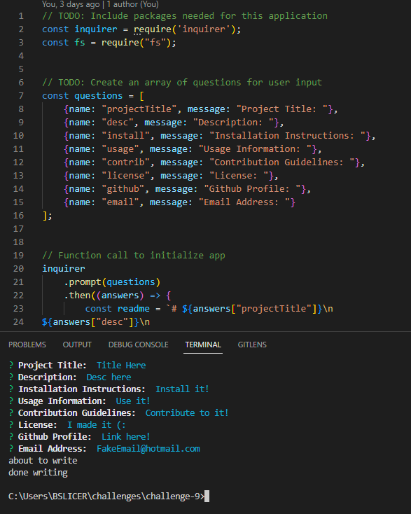

# README Generator

## Description

- My motivation for this project was to create a README generator to expedite the process of typing out and formatting a README for a repository.
- I built this project to further understand how to use node and having it create files based on user input.
- This code is effective in prompting for input and formatting a clear and concise README.
- Composing this note taker, I learned much more about how to effectively use prompts in node, have them print back to the user, and then create a file using the prompt responses.

## Github
- [Github Repository](https://github.com/Celyph/readme-generator)

## Usage

## Credits

I used the ReadMe guide from [https://coding-boot-camp.github.io/full-stack/github/professional-readme-guide](https://coding-boot-camp.github.io/full-stack/github/professional-readme-guide).